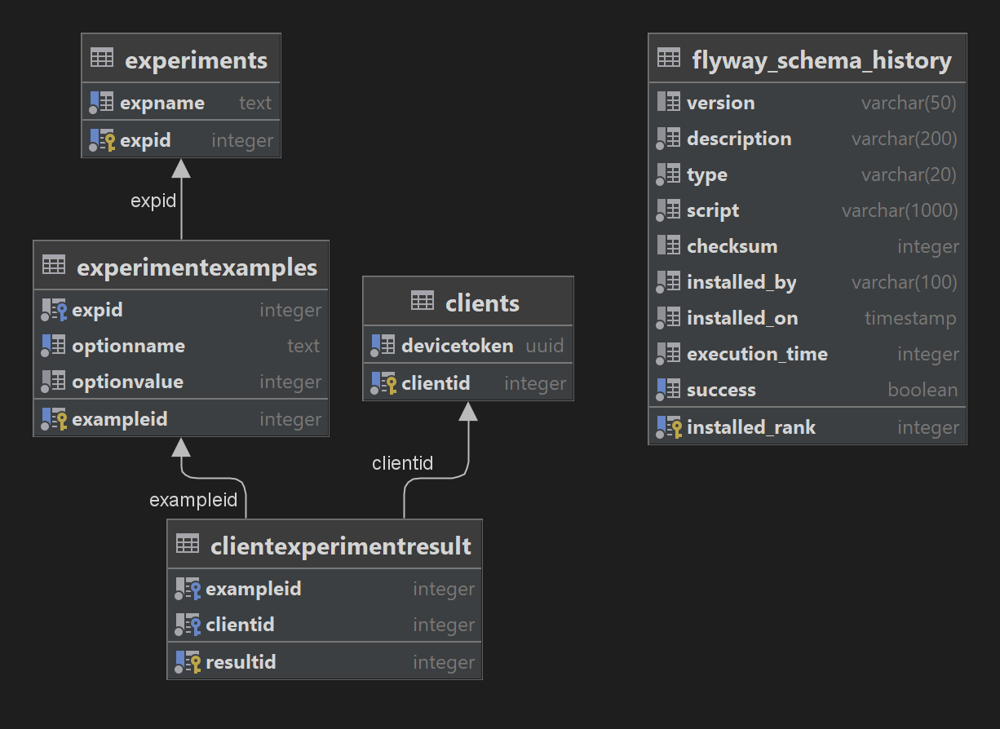

# AB-Tests

1. Instead of MSSQL I used PostgreSQL  
    1.1 Smaller size of image/container for docker  
    1.2 As I know better performance with raw query  
    1.3 Personal preference
2. Migration done with Flyway docker container in compose
3. Due amount of routes I used minimal api(without any controller)
4. Experiments adding in migration script and api will work for any other tests
5. Time ~8hours

**Database diagram**

